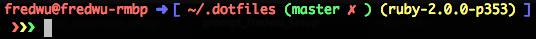

# Fred Wu's Dot Files

## Prerequisites

The following packages need to be installed:

- git (1.8.0+)
- zsh
- vim

For OS X, either Xcode or [Command Line Tools](https://developer.apple.com/downloads/).

For Ubuntu, install `python-software-properties` and [add the Git PPA](https://launchpad.net/~git-core/+archive/ppa):

    apt-get install python-software-properties
    add-apt-repository ppa:git-core/ppa
    apt-get update
    apt-get install git

## Installation

    git clone git://github.com/fredwu/dotfiles ~/.dotfiles
    cd ~/.dotfiles
    ./install.sh

## Custom Configuration

- Make changes to `~/.zsh_custom`
- Use the command `sr` to reload the `.zshrc` source

## Features

- [oh-my-zsh](https://github.com/robbyrussell/oh-my-zsh)
- [zsh-syntax-highlighting](https://github.com/zsh-users/zsh-syntax-highlighting)
- [Janus](https://github.com/carlhuda/janus)
- [RVM](http://beginrescueend.com/)
- .ackrc
- .gemrc
- .gitconfig
- .railsrc
- .vimrc.after
- .vimrc.before
- .zshrc

## Notes

Ruby should be installed manually with RVM, as the requirements change from time to time.
