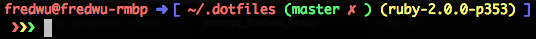

# Fred Wu's dotfiles



An opinionated, idempotent development environment for macOS and Linux. The
installer configures Zsh and Prezto, Neovim with LazyVim, command-line tools,
and the dotfile links in this repository.

## Supported systems

- macOS with Apple Command Line Tools installed
- Debian or Ubuntu (`apt`)
- Fedora (`dnf`)
- Arch Linux (`pacman`)

Both x86-64 and ARM64 Linux are supported. Other Linux distributions can still
use the repository, but the installer stops with a clear error when it cannot
find a supported package manager.

## Installation

```sh
git clone https://github.com/fredwu/dotfiles.git ~/.dotfiles
cd ~/.dotfiles
./install.sh
```

Run the installer as your regular user, not with `sudo`; it requests elevated
permissions only for system package and login-shell changes.

It is safe to run `./install.sh` again. Existing files at managed paths are
moved to a timestamped directory under `~/.dotfiles-backups` before links are
created. Correct links, existing package installations, fonts, and Git
checkouts are left alone.

Claude Code, Codex, and Grok configuration directories are linked from
`~/.claude`, `~/.codex`, and `~/.grok` to their corresponding directories under
`ai/` in this repository. Existing real directories are archived before the
links are created.

The installer changes the account's login shell to Zsh when necessary. Open a
new terminal after it completes.

### Migrating the legacy Vim setup

Run this once on a machine previously configured by the old installer:

```sh
./install.sh --cleanup
```

Cleanup recognises the old spf13-vim checkout, its Vundle plugin tree, known
Vim symlinks, the obsolete Droid Nerd Font, and `use-agent` in the GnuPG
configuration. The Vundle tree, old font, and other ambiguous or modified data
are always archived for manual review; verified generated data is removed.
Historical `*.backup.*` files and `~/.viminfo` are always preserved. Cleanup is
repeatable and then performs the normal install.

## What is installed

- [Prezto](https://github.com/sorin-ionescu/prezto) with prezto-contrib
- [Neovim](https://neovim.io/) and [LazyVim](https://www.lazyvim.org/)
- Hack Nerd Font
- Git, GnuPG, direnv, fzf, zoxide, ripgrep, fd, mise, and related build tools
- Grok, Codex, and Claude Code CLI casks on macOS
- Repository-managed Claude Code, Codex, and Grok configuration

On Linux, official pinned Neovim, mise, and Tree-sitter builds are installed
under `~/.local/opt` as needed. The pinned Neovim is used when the distribution
package is older than the version required by the locked LazyVim configuration.

## Custom configuration

- Put personal shell values in `~/.zsh_custom`; the installer creates it once
  from `zsh/custom.example` and never overwrites it.
- Use `sr` to reload `.zshrc`.
- Add LazyVim options, keymaps, autocommands, and plugin specifications under
  `config/nvim/lua`.

## Installer development

The entry point is intentionally small; implementation modules live in
`install/lib`. Run the isolated test suite with:

```sh
/bin/bash install/tests/run.sh
```

The tests replace `HOME` with a temporary directory and do not use the network,
root privileges, or the real package managers.
