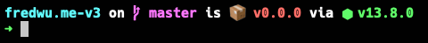

# Fred Wu's Dot Files

## Prerequisites

For OS X, either Xcode or [Command Line Tools](https://developer.apple.com/downloads/).

For Linux, only Ubuntu is supported.

## Installation

    git clone git://github.com/fredwu/dotfiles ~/.dotfiles
    cd ~/.dotfiles
    ./install

## Custom Configuration

- Make changes to `~/.zsh_custom`
- Use the command `sr` to reload the `.zshrc` source

## Features

- [Prezto](https://github.com/sorin-ionescu/prezto)
- [spf13-vim](https://github.com/spf13/spf13-vim)
- [chruby](https://github.com/postmodern/chruby)
- [ruby-install](https://github.com/postmodern/ruby-install)
- [direnv](https://github.com/zimbatm/direnv)
- .ackrc
- .gemrc
- .gitconfig
- .railsrc
- .vimrc.after
- .vimrc.before
- .zshrc
